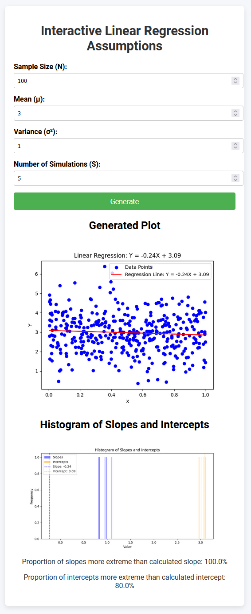

# CS506 Assignment 6: Linear Regression

To run, use `python app.py`. The simple local version looks like the below:

Observe that for large `n` and low variance, the slope approaches zero and the intercept approaches the mean of the distribution.

For the version on my website (https://user04f8.github.io/assignments), see `react-component/LinearRegressionAssumptions.tsx`. To run this version, clone the repo to my website and add `react-component/LinearRegressionAssumptions.tsx` to `vite-src/src/external` and run `npm run dev`.

